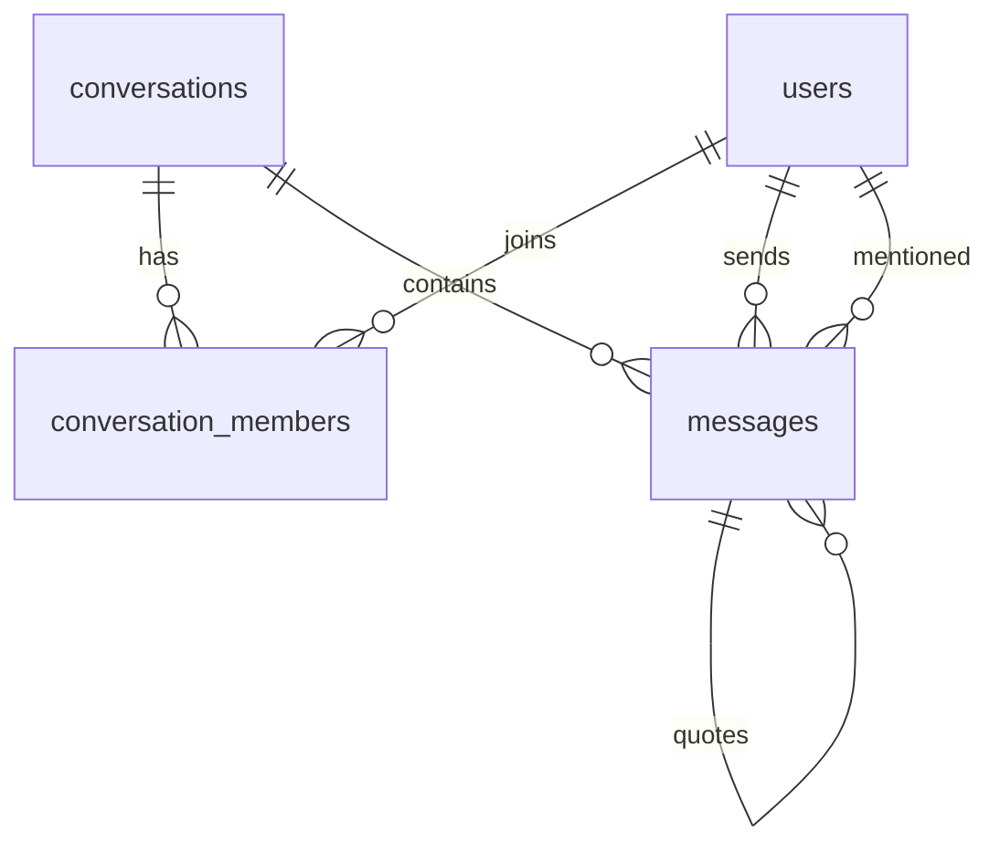

# Chat Demo 数据库设计文档

## 1. 数据库目标

本项目使用 MongoDB。数据库设计需要支持：

- 用户注册、登录和 Members 全站用户列表。
- 群聊创建和会话成员关系。
- 会话列表、未读数、最后消息。
- 消息历史、引用回复、@ 提及。
- Socket.IO 实时事件所需的数据查询。

MongoDB 中没有传统关系型数据库的“表”，本文将 collection 视为面试题里所说的数据库表。

Redis 会用于缓存热点查询和 Socket.IO 多实例广播，但 Redis 不是最终数据源。所有用户、会话、成员关系、消息和未读数的最终一致数据以 MongoDB 为准。Redis 详细设计见 `redis_design.md`。

## 2. 数据库名称

推荐数据库名：

```text
chat-demo
```

开发环境连接：

```text
mongodb://localhost:27017/chat-demo
```

## 3. Collections

### 3.1 `users`

用途：

- 存储所有注册用户。
- Members 页面直接读取该集合，所以 Members 显示的是数据库中所有注册用户，不是好友列表。

字段：

| 字段 | 类型 | 必填 | 说明 |
|---|---|---|---|
| `_id` | ObjectId | 是 | 用户 ID |
| `username` | string | 是 | 登录用户名，唯一，统一小写 |
| `passwordHash` | string | 是 | bcrypt 或 argon2 哈希 |
| `name` | string | 是 | 展示名 |
| `avatarUrl` | string/null | 否 | 头像 URL |
| `title` | string/null | 否 | 职位或副标题 |
| `createdAt` | Date | 是 | 创建时间 |
| `updatedAt` | Date | 是 | 更新时间 |

索引：

```js
db.users.createIndex({ username: 1 }, { unique: true });
db.users.createIndex({ name: 1 });
db.users.createIndex({ createdAt: -1 });
```

查询场景：

- 登录：按 `username` 精确查询。
- Members 页面：按 `createdAt` 或 `name` 排序查询所有用户。
- 搜索用户：按 `name` 和 `username` 模糊查询。

### 3.2 `conversations`

用途：

- 存储聊天会话。
- 群聊创建时写入一条 `GROUP` conversation。
- 会话列表只展示当前用户在 `conversation_members` 中参与的 conversation。

字段：

| 字段 | 类型 | 必填 | 说明 |
|---|---|---|---|
| `_id` | ObjectId | 是 | 会话 ID |
| `name` | string | 是 | 会话名 |
| `type` | string | 是 | `GROUP` 或 `DIRECT` |
| `avatarUrls` | string[] | 是 | 群聊头像拼图用，默认空数组 |
| `lastMessageId` | ObjectId/null | 否 | 最后一条消息 ID |
| `createdByUserId` | ObjectId/null | 否 | 创建者，种子会话可为空 |
| `createdAt` | Date | 是 | 创建时间 |
| `updatedAt` | Date | 是 | 排序时间 |

索引：

```js
db.conversations.createIndex({ updatedAt: -1 });
db.conversations.createIndex({ createdByUserId: 1, createdAt: -1 });
```

查询场景：

- 会话列表：先从 `conversation_members` 找当前用户参与的 conversationIds，再查 conversations。
- 群聊创建：插入 conversation 后批量插入 conversation_members。
- 消息发送：更新 `lastMessageId` 和 `updatedAt`。

### 3.3 `conversation_members`

用途：

- 存储用户和会话的成员关系。
- 存储每个用户视角的未读数。
- 群聊成员来自这个集合，不等同于好友关系。

字段：

| 字段 | 类型 | 必填 | 说明 |
|---|---|---|---|
| `_id` | ObjectId | 是 | 记录 ID |
| `conversationId` | ObjectId | 是 | 会话 ID |
| `userId` | ObjectId | 是 | 用户 ID |
| `role` | string | 是 | `OWNER` 或 `MEMBER` |
| `unreadCount` | number | 是 | 当前用户在该会话的未读数 |
| `mentionCount` | number | 是 | 当前用户在该会话被 @ 的未读数 |
| `lastReadAt` | Date/null | 否 | 最近已读时间 |
| `createdAt` | Date | 是 | 加入时间 |
| `updatedAt` | Date | 是 | 更新时间 |

索引：

```js
db.conversation_members.createIndex(
  { conversationId: 1, userId: 1 },
  { unique: true }
);
db.conversation_members.createIndex({ userId: 1, updatedAt: -1 });
db.conversation_members.createIndex({ conversationId: 1, role: 1 });
```

查询场景：

- 当前用户会话列表。
- 校验用户是否是会话成员。
- 查询当前会话成员，用于 @ 提及。
- 创建群聊时写入 owner 和 member 关系。
- 标记已读时更新当前用户记录。

### 3.4 `messages`

用途：

- 存储文本消息。
- 支持引用回复和 @ 提及。

字段：

| 字段 | 类型 | 必填 | 说明 |
|---|---|---|---|
| `_id` | ObjectId | 是 | 消息 ID |
| `conversationId` | ObjectId | 是 | 会话 ID |
| `senderId` | ObjectId | 是 | 发送人 ID |
| `type` | string | 是 | 当前只支持 `TEXT` |
| `body` | string | 是 | 消息文本 |
| `quoteMessageId` | ObjectId/null | 否 | 被引用消息 |
| `mentionUserIds` | ObjectId[] | 是 | 被提及用户 ID，默认空数组 |
| `createdAt` | Date | 是 | 创建时间 |
| `updatedAt` | Date | 是 | 更新时间 |

索引：

```js
db.messages.createIndex({ conversationId: 1, createdAt: -1, _id: -1 });
db.messages.createIndex({ senderId: 1, createdAt: -1 });
db.messages.createIndex({ mentionUserIds: 1 });
db.messages.createIndex({ quoteMessageId: 1 });
```

查询场景：

- 消息历史分页。
- 发送消息后更新 conversation lastMessage。
- 引用回复 hydrate。
- mention 用户 hydrate。

## 4. 关系说明



说明：

- `users` 是所有注册用户来源，Members 页面直接展示它。
- `conversation_members` 表示用户参与了哪些会话。
- 群聊成员不是好友关系；项目不设计 friends collection。
- `messages.mentionUserIds` 只允许保存当前 conversation 的成员用户。

## 5. 群聊创建数据流

1. 前端调用 `users` 查询所有注册用户。
2. 用户选择若干其他用户并输入群名。
3. 后端创建 `conversations`：
   - `type = GROUP`
   - `createdByUserId = currentUserId`
   - `lastMessageId = null`
4. 后端创建 `conversation_members`：
   - 当前用户 role 为 `OWNER`
   - 其他用户 role 为 `MEMBER`
   - 所有人 unreadCount 为 0
5. 后端向所有成员的 `user:{userId}` room 推送 `conversation.created`。

## 6. 初始化脚本

脚本路径：

```text
scripts/init-database.sh
scripts/init-database.mongosh.js
```

运行方式：

```bash
./scripts/init-database.sh
```

自定义数据库地址：

```bash
MONGODB_URI="mongodb://localhost:27017/chat-demo" ./scripts/init-database.sh
```

脚本职责：

- 创建 collections。
- 添加 JSON Schema validator。
- 创建 indexes。
- 不插入 seed data。

不插入 seed data 的原因：

- 用户密码需要由后端使用 bcrypt 或 argon2 生成 hash。
- 种子数据建议由后端 `seedDatabase()` 生成，避免数据库脚本和应用密码哈希策略不一致。
