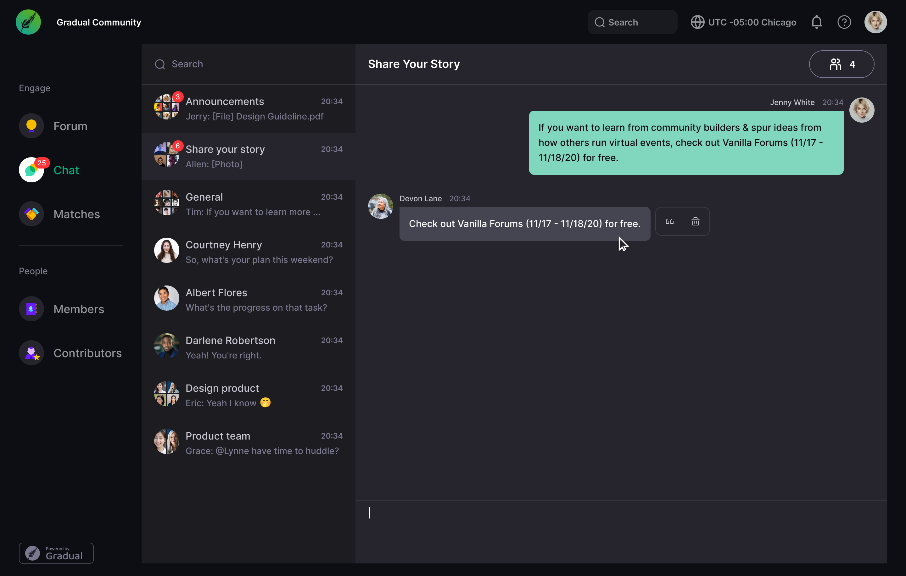

# Figma Design Spec

**File:** Full-Stack Developer Assignment  
**Last Modified:** 2025-10-15T01:21:12Z  
**File ID:** CBKcxWGEJGFe05ZsbgZZ2z  
**Figma Link:** https://www.figma.com/design/CBKcxWGEJGFe05ZsbgZZ2z/

---

## Quote
**Page:** Page 1  
**ID:** `0:394`  
**Size:** 1440.0 × 916.0 px  
**Children:** 7 nodes

**Background:** rgba(12,14,19,1.0)

**Colors used:**
- `rgb(123,121,143)`
- `rgb(146,150,153)`
- `rgb(153,153,153)`
- `rgb(201,199,208)`
- `rgb(255,255,255)`
- `rgb(4,177,125)`
- `rgb(69,67,80)`
- `rgba(0,181,105,1.0)`
- `rgba(108,25,255,1.0)`
- `rgba(12,14,19,1.0)`
- `rgba(121,123,133,1.0)`
- `rgba(123,121,143,1.0)`
- `rgba(125,235,245,1.0)`
- `rgba(146,150,153,1.0)`
- `rgba(196,196,196,1.0)`
- `rgba(201,199,208,1.0)`
- `rgba(235,143,0,1.0)`
- `rgba(245,188,0,1.0)`
- `rgba(253,51,56,1.0)`
- `rgba(255,255,255,1.0)`
- `rgba(29,28,33,1.0)`
- `rgba(33,0,196,1.0)`
- `rgba(38,37,45,1.0)`
- `rgba(4,177,125,1.0)`
- `rgba(53,51,61,1.0)`
- `rgba(54,52,62,1.0)`
- `rgba(59,177,4,1.0)`
- `rgba(61,217,235,1.0)`
- `rgba(61,218,180,1.0)`
- `rgba(66,43,13,1.0)`
- `rgba(69,67,80,1.0)`

**Fonts used:**
- `Inter 400 12.0px`
- `Inter 500 11.0px`
- `Inter 500 12.0px`
- `Inter 500 13.0px`
- `Inter 500 14.0px`
- `Inter 500 15.0px`
- `Inter 500 16.0px`
- `Inter 500 18.0px`
- `Inter 600 12.0px`
- `Inter 600 14.0px`
- `Inter 600 15.0px`
- `Inter 600 18.0px`

**Screenshot:**  

### Children
| Name | Type | X | Y | W | H |
|------|------|---|---|---|---|
| Rectangle 291 | RECTANGLE | -719.5 | -458.0 | 1079.999755859375 | 64.12000274658203 |
| Frame 1000006640 | FRAME | -721.0 | -458.0 | 1440.0 | 896.0 |
| Frame 1986 | FRAME | -691.0 | 405.0 | 119.0 | 33.43696594238281 |
| unread | INSTANCE | -447.0 | -313.0 | 18.0 | 18.0 |
| unread | INSTANCE | -447.0 | -235.0 | 18.0 | 18.0 |
| message hover | INSTANCE | 320.5 | -129.0 | 87.0 | 46.0 |
| icon/hover | INSTANCE | 254.0 | -85.0 | 30.0 | 30.0 |

---

## Mentions
**Page:** Page 1  
**ID:** `0:846`  
**Size:** 1440.0 × 916.0 px  
**Children:** 6 nodes

**Background:** rgba(12,14,19,1.0)

**Colors used:**
- `rgb(123,121,143)`
- `rgb(146,150,153)`
- `rgb(201,199,208)`
- `rgb(255,255,255)`
- `rgb(4,177,125)`
- `rgb(69,67,80)`
- `rgba(0,181,105,1.0)`
- `rgba(108,25,255,1.0)`
- `rgba(12,14,19,1.0)`
- `rgba(121,123,133,1.0)`
- `rgba(123,121,143,1.0)`
- `rgba(125,235,245,1.0)`
- `rgba(146,150,153,1.0)`
- `rgba(196,196,196,1.0)`
- `rgba(201,199,208,1.0)`
- `rgba(235,143,0,1.0)`
- `rgba(245,188,0,1.0)`
- `rgba(253,51,56,1.0)`
- `rgba(255,255,255,1.0)`
- `rgba(29,28,33,1.0)`
- `rgba(33,0,196,1.0)`
- `rgba(38,37,45,1.0)`
- `rgba(4,177,125,1.0)`
- `rgba(53,51,61,1.0)`
- `rgba(53,52,62,1.0)`
- `rgba(59,177,4,1.0)`
- `rgba(61,217,235,1.0)`
- `rgba(61,218,180,1.0)`
- `rgba(66,43,13,1.0)`
- `rgba(69,67,80,1.0)`
- `rgba(69,68,81,1.0)`

**Fonts used:**
- `Inter 500 10.0px`
- `Inter 500 11.0px`
- `Inter 500 12.0px`
- `Inter 500 13.0px`
- `Inter 500 14.0px`
- `Inter 500 15.0px`
- `Inter 500 16.0px`
- `Inter 500 18.0px`
- `Inter 600 12.0px`
- `Inter 600 14.0px`
- `Inter 600 15.0px`
- `Inter 600 18.0px`

**Screenshot:**  

### Children
| Name | Type | X | Y | W | H |
|------|------|---|---|---|---|
| Rectangle 291 | RECTANGLE | -719.5 | 610.0 | 1079.999755859375 | 64.12000274658203 |
| Frame 1000006640 | FRAME | -721.0 | 610.0 | 1440.0 | 896.0 |
| Frame 1986 | FRAME | -691.0 | 1473.0 | 119.0 | 33.43696594238281 |
| unread | INSTANCE | -447.0 | 755.0 | 18.0 | 18.0 |
| unread | INSTANCE | -447.0 | 833.0 | 18.0 | 18.0 |
| dropdown/normal | FRAME | -144.0 | 1345.0 | 260.0 | 64.0 |

---

## Quote
**Page:** Page 1  
**ID:** `0:1189`  
**Size:** 1440.0 × 916.0 px  
**Children:** 6 nodes

**Background:** rgba(12,14,19,1.0)

**Colors used:**
- `rgb(123,121,143)`
- `rgb(146,150,153)`
- `rgb(153,153,153)`
- `rgb(201,199,208)`
- `rgb(255,255,255)`
- `rgb(4,177,125)`
- `rgb(69,67,80)`
- `rgba(0,181,105,1.0)`
- `rgba(108,25,255,1.0)`
- `rgba(12,14,19,1.0)`
- `rgba(121,123,133,1.0)`
- `rgba(123,121,143,1.0)`
- `rgba(125,235,245,1.0)`
- `rgba(146,150,153,1.0)`
- `rgba(196,196,196,1.0)`
- `rgba(201,199,208,1.0)`
- `rgba(235,143,0,1.0)`
- `rgba(245,188,0,1.0)`
- `rgba(253,51,56,1.0)`
- `rgba(255,255,255,1.0)`
- `rgba(29,28,33,1.0)`
- `rgba(33,0,196,1.0)`
- `rgba(38,37,45,1.0)`
- `rgba(4,177,125,1.0)`
- `rgba(53,51,61,1.0)`
- `rgba(54,52,62,1.0)`
- `rgba(59,177,4,1.0)`
- `rgba(61,217,235,1.0)`
- `rgba(61,218,180,1.0)`
- `rgba(66,43,13,1.0)`
- `rgba(69,67,80,1.0)`

**Fonts used:**
- `Inter 500 11.0px`
- `Inter 500 12.0px`
- `Inter 500 13.0px`
- `Inter 500 14.0px`
- `Inter 500 15.0px`
- `Inter 500 16.0px`
- `Inter 500 18.0px`
- `Inter 600 12.0px`
- `Inter 600 14.0px`
- `Inter 600 15.0px`
- `Inter 600 18.0px`

**Screenshot:**  

### Children
| Name | Type | X | Y | W | H |
|------|------|---|---|---|---|
| Rectangle 291 | RECTANGLE | 775.5 | -458.0 | 1079.999755859375 | 64.12000274658203 |
| Frame 1000006640 | FRAME | 774.0 | -458.0 | 1440.0 | 896.0 |
| Frame 1986 | FRAME | 804.0 | 405.0 | 119.0 | 33.43696594238281 |
| unread | INSTANCE | 1048.0 | -313.0 | 18.0 | 18.0 |
| unread | INSTANCE | 1048.0 | -235.0 | 18.0 | 18.0 |
| quote/entering | INSTANCE | 1360.0 | 378.0 | 384.0 | 41.0 |

---

## Quote
**Page:** Page 1  
**ID:** `1:860`  
**Size:** 1440.0 × 916.0 px  
**Children:** 5 nodes

**Background:** rgba(12,14,19,1.0)

**Colors used:**
- `rgb(123,121,143)`
- `rgb(146,150,153)`
- `rgb(153,153,153)`
- `rgb(201,199,208)`
- `rgb(255,255,255)`
- `rgb(4,177,125)`
- `rgb(69,67,80)`
- `rgba(0,181,105,1.0)`
- `rgba(108,25,255,1.0)`
- `rgba(12,14,19,1.0)`
- `rgba(121,123,133,1.0)`
- `rgba(123,121,143,1.0)`
- `rgba(125,235,245,1.0)`
- `rgba(146,150,153,1.0)`
- `rgba(196,196,196,1.0)`
- `rgba(201,199,208,1.0)`
- `rgba(235,143,0,1.0)`
- `rgba(245,188,0,1.0)`
- `rgba(253,51,56,1.0)`
- `rgba(255,255,255,1.0)`
- `rgba(29,28,33,1.0)`
- `rgba(33,0,196,1.0)`
- `rgba(38,37,45,1.0)`
- `rgba(4,177,125,1.0)`
- `rgba(53,51,61,1.0)`
- `rgba(54,52,62,1.0)`
- `rgba(59,177,4,1.0)`
- `rgba(61,217,235,1.0)`
- `rgba(61,218,180,1.0)`
- `rgba(66,43,13,1.0)`
- `rgba(69,67,80,1.0)`

**Fonts used:**
- `Inter 500 11.0px`
- `Inter 500 12.0px`
- `Inter 500 13.0px`
- `Inter 500 14.0px`
- `Inter 500 15.0px`
- `Inter 500 16.0px`
- `Inter 500 18.0px`
- `Inter 600 12.0px`
- `Inter 600 14.0px`
- `Inter 600 15.0px`
- `Inter 600 18.0px`

**Screenshot:**  

### Children
| Name | Type | X | Y | W | H |
|------|------|---|---|---|---|
| Rectangle 291 | RECTANGLE | 2310.5 | -458.0 | 1079.999755859375 | 64.12000274658203 |
| Frame 1000006640 | FRAME | 2309.0 | -458.0 | 1440.0 | 896.0 |
| Frame 1986 | FRAME | 2339.0 | 405.0 | 119.0 | 33.43696594238281 |
| unread | INSTANCE | 2583.0 | -313.0 | 18.0 | 18.0 |
| unread | INSTANCE | 2583.0 | -235.0 | 18.0 | 18.0 |

---
